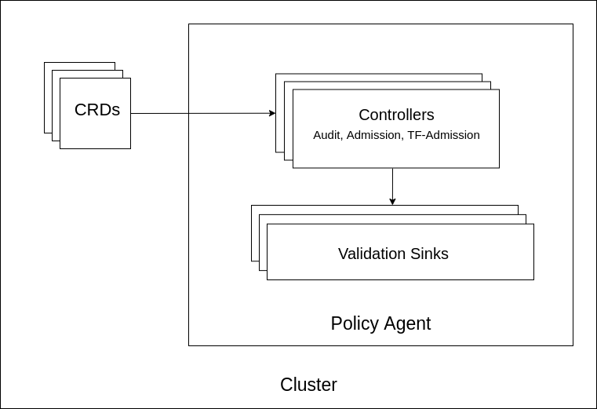

# Documentation

- [High Level Architecture](#high-level-architecture)
- [Custom Resources](#custom-resources)
  - [Policy](#policy)
  - [PolicySet](#policyset)
  - [PolicyConfig](#policyconfig)
- [Modes](#modes)
  - [Audit](#audit)
  - [Admission](#admission)
  - [Terraform Admission](#terraform-admission)
- [Validation Sinks](#validation-Sinks)
  - [Kubernetes Events](#kubernetes-events)
  - [Flux Notification COntroller](#flux-notification-controller)
  - [File System](#file-system)
  - [ElasticSearch](#elasticsearch)
  - [SaaS](#saas)
- [Configuration](#configuration)
- [Versions](#versions)
- [Development](#development)


## High Level Architecture



The Policy agent can run in 3 different modes. [Audit](#audit), [Admission](#admission), and [Terraform Admission](#terraform-admission) and it can run in multiple modes in the same time.

Each mode has it's own logic and they all push their results to the [Validations Sinks](#validation-sinks).


## Custom Resources

Currently there are three [Kubernetes Custom Resources](https://kubernetes.io/docs/concepts/extend-kubernetes/api-extension/custom-resources/) registered in the agent API

### Policy

This is the main resource and it is used to define policies which will be evaluated by the policy agent.

> See more about Policy CRD [here](./policy.md)

### PolicySet

This is an optional resource. It is used to select group of policies to work in specific [mode](#modes).

> See more about PolicySet CRD [here](./policy_set.md)


### PolicyConfig

This is an optional resource. It is used to provide multiple policy configurations for the same policy for different resources, applications, namespaces and workspaces.

> See more about PolicyConfig CRD [here](./policy_config.md)


## Modes

### Audit

This mode performs the audit functionality. It triggers per the specified interval (by default every 24 hour) and then lists all the resources in the cluster which the agent has access to read and validates those resources against the audit policies.

> Works with policies of provider `kubernetes`


### Admission

This contains the admission module that enforces policies. It uses the `controller-runtime` Kubernetes package to register a callback that will be called when the agent recieves an admission request. Once called, the agent will validate the received resource against the admission and tenant policies and k8s will use the result of this validation to either allow or reject the creation/update of said resource.

> Works with policies of provider `kubernetes`

#### Mutating Resources

Starting from version `v2.2.0`, the policy agent will support mutating resources. To enable mutating resources set `mutate` flag to `true` in the `admission` configuration section.

```yaml
admission:
   enabled: true
   mutate: true # set this field to true to enable mutating resources
   sinks:
      filesystemSink:
         fileName: admission.txt
```

> See [here](./policy.md#mutating-resources) how to make policies support mutating resources.

### Terraform Admission

This is a webhook used to validate terraform plans. It is mainly used by the [TF-Controller](https://github.com/weaveworks/tf-controller) to enforce policies on terraform plans

> Works with policies of provider `terraform`


## Validation Sinks

### Kubernetes Events

This sink is used to export validation results as kubernetes native events. Kubernetes event has a retention period and it set by default to 1 hour, you can configure the kubernetes [api-server](https://kubernetes.io/docs/reference/command-line-tools-reference/kube-apiserver/) to update the period.

**Configuration**

```yaml
sinks:
  k8sEventsSink:
    enabled: true
```

### Flux Notification Controller

This sink sends the validation results to [Flux Notification Controller](https://github.com/fluxcd/notification-controller).

**Configuration**

```yaml
sinks:
  fluxNotificationSink:
    address: <>
```

### File System

File system sink writes the validation results to a text file. The file will be located at `/logs/<filename>`

**Configuration**

```yaml
sinks:
  fileSystemSink:
    fileName: audit.txt
```

### ElasticSearch

This sink stores the validation results in ElasticSearch. Here is the object [schema](./internal/sink/elastic/schema.json).

**Configuration**

```yaml
sinks:
  elasticSink:
    address: http://localhost:9200    # ElasticSearch server address
    username: <elastic username>      # User credentials to access ElasticSearch service
    password: <elastic password>      # User credentials to access ElasticSearch service
    indexName: <index_name>           # index name the results would be written in
    insertionMode: <insertion mode>   # It could be a choice of both insert or upsert, it defines the way the document is written.
```

#### Insertion modes
- `insert`: would give an insight of all the historical data, doesn't update or delete any old records. so the index would contain a log for all validation objects.

- `upsert`: Would update the old result of validating an entity against a policy happens in the same day, so the index would only contain the latest validation results for a policy and entity combination per day.


### SaaS

This sink sends the validation results to [Weave Policy](https://policy.weave.works) SaaS's backend over websockets.

**Configuration**

```yaml
sinks:
  saaSGatewaySink:
    url: <agent gateway websocket url>
    secret: <polciy agent secret>
```


## Configuration

The config file is the single entry point for configuring the agent.

The agent needs the following parameters to be provided in the configuration yaml file:

- `kubeConfigFile`: path to the kubernetes config file to access the cluster
- `accountId`: unique identifier that signifies the owner of that agent
- `clusterId`: unique identifier for the cluster that the agent will run against

There are additional parameters could be provided:

- `logLevel`: app log level (default: "info")
- `probesListen`: address for the probes server to run on (default: ":9000")
- `metricsAddress`: address the metric endpoint binds to (default: ":8080")
- `audit`: defines cluster periodical audit configuration including the supported sinks (disabled by default)
- `admission`: defines admission control configuration including the supported sinks and webhooks (disabled by default)
- `tfAdmission`: defines terraform admission control configuration including the supported sinks (disabled by default)


**Example**

```yaml
accountId: "account-id"
clusterId: "cluster-id"
kubeConfigFile: "/.kube/config"
logLevel: "Info"
admission:
   enabled: true
   sinks:
      filesystemSink:
         fileName: admission.txt
audit:
   enabled: true
   writeCompliance: true
   sinks:
      filesystemSink:
         fileName: audit.txt
```


## Versions

### v1
- Initial release
- Introduced Policy CRD
### v1beta1
- Introduced PolicySet CRD
### v2beta2
- Introduced PolicyConfig CRD
- Added `mode` field to PolicySet CRD
- Added `status.modes` field to Policy CRD 

## Development

See the [Development guide](./development.md) here