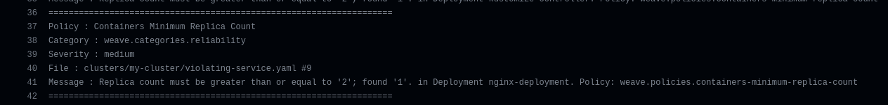
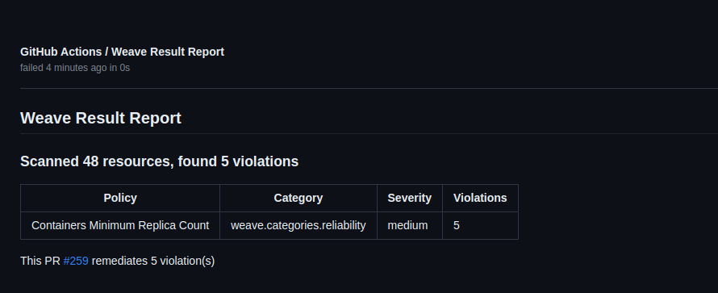
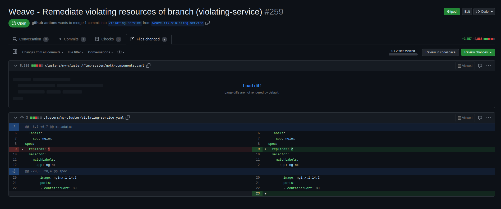
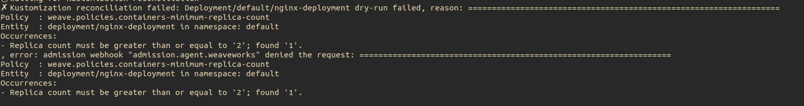

# End to end demo

## Prerequisites

- Kubernetes Cluster (>= v1.20)
- [Flux](https://fluxcd.io/flux/installation/) (>= v0.36.0)
- [kubectl](https://kubernetes.io/docs/tasks/tools/#kubectl)
- [Policy Agent](./getting-started.md)
- [Weave Policy Validator](https://github.com/weaveworks/weave-policy-validator/blob/main/README.md)
- [Violating Service](./violating-service.yaml)


## Configurations

Install the [Policy Agent](./getting-started.md) and make sure to install the policies in your cluster.

Copy the [policies](../policies/) to the root of the repository (for commit time validation)

Copy the Weave Policy Validator [Github Action](./weave-policy-validator-gh-action.yml) to the root of repository under (`.github/workflows/weave-policy-validator-gh-action.yml`)

The repository structure should be something like the one below

  ```bash
    .
    ├── .github
    │   └── workflows
    │       └── weave-policy-validator-gh-action.yml
    ├── clusters
    │   ├── bases
    │   │   ├── networkpolicy
    │   │   │   └── flux-system-networkpolicy.yaml
    │   │   └── rbac
    │   │       └── wego-admin.yaml
    │   └── my-cluster
    │       ├── flux-system
    │       │   ├── gotk-components.yaml
    │       │   ├── gotk-sync.yaml
    │       │   └── kustomization.yaml
    │       ├── policies.yaml
    │       ├── wpa-helmrelease.yaml
    │       └── wpa-helmrepo.yaml
    └── policies
        ├── ControllerContainerAllowingPrivilegeEscalation.yaml
        ├── ControllerContainerBlockSysctls.yaml
        ├── ControllerContainerRunningAsRoot.yaml
        ├── ControllerMinimumReplicaCount.yaml
        ├── ControllerReadOnlyFileSystem.yaml
        └── kustomization.yaml

  ```

## Flow

### Commit time validation

This will validate the repository entites in the commit time by using the CI.

Create new branch from the repository and add the [Violating Service](./violating-service.yaml)
to this path `clusters/my-cluster/violating-service.yaml` then create a pull request with this branch against `main`


Once the PR is created the Weave Policy Validator Github Action will start checking for violations and attempt to fix it
  
  

A report will be generated to make it easy to view the violations

  

Also a remediation pull request will created to fix the violations that will require the user review

  


### Policy Agent validation

If a file sneaked somehow into the repository to the cluster, then the Policy Agent's admission controller will stop it

Go ahead and push the file `clusters/my-cluster/violating-service.yaml` directly into `main` to skip the CI checks

Flux reconcillation will fail with the following error and the violating service will not be applied to the cluster

  


## Tear down

Remove the violating service from the repository

Remove the policies directory and the workflow directory from the repository

Remove the policy agent files (HelmRepository, HelmRelease, Policies) from the repository

Wait/Trigger flux reconcillation
