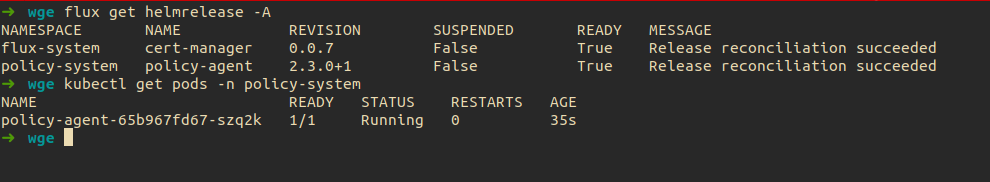

# Getting Started With Weave Policy Agent

## Prerequisites

- [Kubernetes Cluster](https://kubernetes.io/) (v1.20 or newer)
- [Flux](https://fluxcd.io/flux/installation/) (v0.36.0 or newer) (optional)
- [Cert Manager](https://cert-manager.io/docs/installation/) (v1.5.0) or newer
- [kubectl](https://kubernetes.io/docs/tasks/tools/#kubectl)
- [helm](https://helm.sh/docs/intro/install/) (Optional)
- [kustomize](https://kubectl.docs.kubernetes.io/installation/kustomize/) (optional)

## Installing Weave Policy Agent

Weave Policy Agent can be installed using 2 methods (By using HelmRelease and Flux, By using Helm)

### Using HelmRelease and Flux

To install Weave Policy Agent using `Flux` it requires the `HelmRepository` and `HelmRelease` for the Weave Policy Agent  to be applied into your cluster by adding them to your cluster repository in a location that's readable by flux.

<details>
  <summary>Click to expand Weave Policy Agent HelmRepository </summary>

```yaml
apiVersion: source.toolkit.fluxcd.io/v1beta2
kind: HelmRepository
metadata:
creationTimestamp: null
name: policy-agent
namespace: flux-system
spec:
interval: 1m0s
timeout: 1m0s
url: https://weaveworks.github.io/policy-agent/
status: {}
```
</details>

<details>
  <summary>Click to expand Weave Policy Agent HelmRelease </summary>

```yaml
apiVersion: helm.toolkit.fluxcd.io/v2beta1
kind: HelmRelease
metadata:
  name: policy-agent
  namespace: flux-system
spec:
  chart:
    spec:
      chart: policy-agent
      sourceRef:
        apiVersion: source.toolkit.fluxcd.io/v1beta2
        kind: HelmRepository
        name: policy-agent
        namespace: flux-system
      version: 2.3.0
  interval: 10m0s
  targetNamespace: policy-system
  values:
    caCertificate: ""
    certificate: ""
    config:
      accountId: ""
      admission:
        enabled: true
        sinks:
          k8sEventsSink:
            enabled: true
      audit:
        enabled: false
      clusterId: ""
    excludeNamespaces:
    - kube-system
    failurePolicy: Fail
    image: weaveworks/policy-agent
    key: ""
    persistence:
      enabled: false
    useCertManager: true
status: {}
```
</details>

Once the `HelmRepository` and `HelmRelease` are reconciled by `Flux` you should find the Policy Agent installed on your cluster.

Check installation status using

```bash
flux get helmrelease -A
kubectl get pods -n policy-system
```



### Using Helm

- Create `policy-system` namespace to install the chart in

    ```bash
    kubectl create ns policy-system
    ```

- Add the Weave Policy Agent helm chart

    ```bash
    helm repo add policy-agent https://weaveworks.github.io/policy-agent/
    ```

- Install the helm chart

    ```bash
    helm install policy-agent policy-agent/policy-agent -n policy-system
    ```

Check installation status using

```bash
flux get helmrelease -A
kubectl get pods -n policy-system
```

## Installing Policies

The [Policy CRD](../helm/crds/pac.weave.works_policies.yaml) is used to define policies which are then consumed and used by the agent to validate entities.

It uses OPA Rego Language to evaluate the entities.

### Installing Policies Using Flux

To install default policies create a `kustomization` to reference the default policies from the policy agent repository

<details>
  <summary>Click to expand Policies kustomization </summary>

```yaml
apiVersion: source.toolkit.fluxcd.io/v1
kind: GitRepository
metadata:
  name: policies
  namespace: default
spec:
  interval: 5m
  url: https://github.com/weaveworks/policy-agent/
  ref:
    branch: open-source-policy-agent # TODO: change to master
---
apiVersion: kustomize.toolkit.fluxcd.io/v1
kind: Kustomization
metadata:
  name: policies
  namespace: default
spec:
  interval: 10m
  targetNamespace: default
  sourceRef:
    kind: GitRepository
    name: policies
  path: "./policies"
  prune: true
  timeout: 1m
```
</details>

### Installing Policies Using Kustomize

You can use kustomize to install the default policies from the Policy Agent repository by applying this kustomization

<details>
  <summary>Click to expand the default policies kustomization </summary>

```yaml
apiVersion: kustomize.config.k8s.io/v1beta1
kind: Kustomization
resources:
- github.com/weaveworks/policy-agent/policies
```

</details>

### Verify Policies Installation

By using the following command

```bash
kubectl get policies
```

## Explore Violations

- Sync a new or existing service that has one or more violations and watch it getting blocked by the Policy Agent 
- If you don’t have a violating service and want to test the agent out, you can apply this violating service as an example

    <details>
    <summary>Click to expand violating deployment </summary>

    ```yaml
    apiVersion: apps/v1
    kind: Deployment
    metadata:
    name: nginx-deployment
    namespace: default
    labels:
        app: nginx
    spec:
    replicas: 1
    selector:
        matchLabels:
        app: nginx
    template:
        metadata:
        labels:
            app: nginx
        spec:
        containers:
        - name: nginx
            image: nginx:1.14.2
            ports:
            - containerPort: 80
    ```

    </details>

- The violation of the admission controller should look like this

    <details>
    <summary>Click to expand the admission controller response for the violation </summary>

    ```bash
    Error from server (==================================================================
    ==================================================================
    Policy	: weave.policies.containers-minimum-replica-count
    Entity	: deployment/nginx-deployment in namespace: default
    Occurrences:
    - Replica count must be greater than or equal to '2'; found '1'.
    ): error when creating "deployment.yaml": admission webhook "admission.agent.weaveworks" denied the request: 
    ==================================================================
    Policy	: weave.policies.containers-minimum-replica-count
    Entity	: deployment/nginx-deployment in namespace: default
    Occurrences:
    - Replica count must be greater than or equal to '2'; found '1'.
    ```

    </details>

- To view the violating events by using `kubectl`

    ```bash
    kubectl get events --field-selector type=Warning,reason=PolicyViolation -A
    ```

- To view the violating events by using WeaveGitOps UI

    

## Fix & Exclude

- To fix the violation, each policy has a `how_to_solve` section and it's used by the admission controller to make a suggestion for you to how to fix the violation in your resource `yaml` file. The following example for Minimum Replica Count Policy
  
    

    ```bash
    Policy	: weave.policies.containers-minimum-replica-count
    Entity	: deployment/nginx-deployment in namespace: default
    Occurrences:
    - Replica count must be greater than or equal to '2'; found '1'.
    ```

- To prevent the agent from scanning certain namespaces and stop deployments, you can add these namespaces to `excludeNamespaces` in the Policy Agent helm chart values file

- To prevent certain policy from running in a specific namespace, you can add these namespaces to the policy either by direct modification to the policy file or by using `kustomize` overlays

## References

- [HelmRepository](https://fluxcd.io/flux/components/source/helmrepositories/)
- [HelmRelease](https://fluxcd.io/flux/components/helm/helmreleases/)

## FAQ
