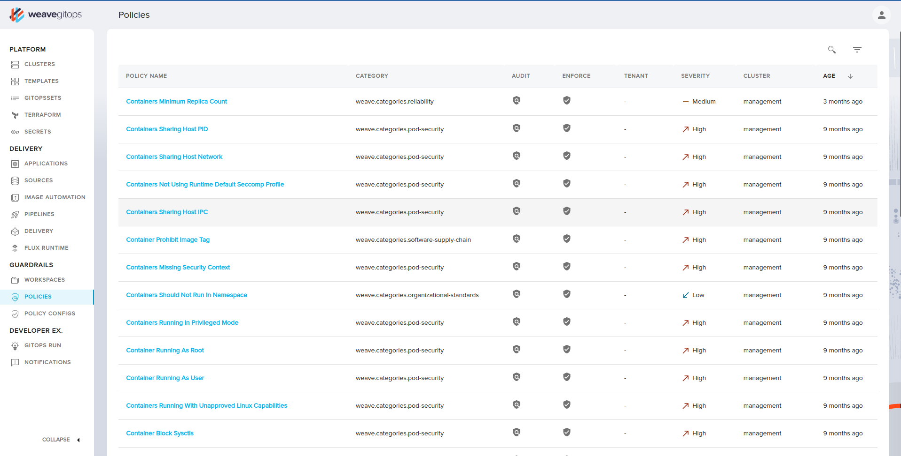
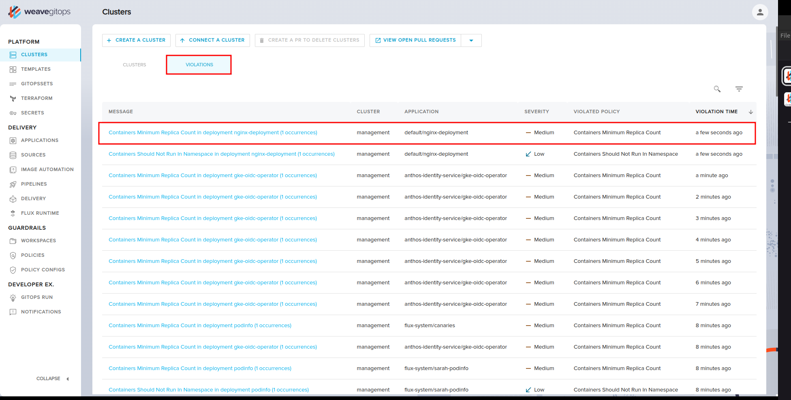
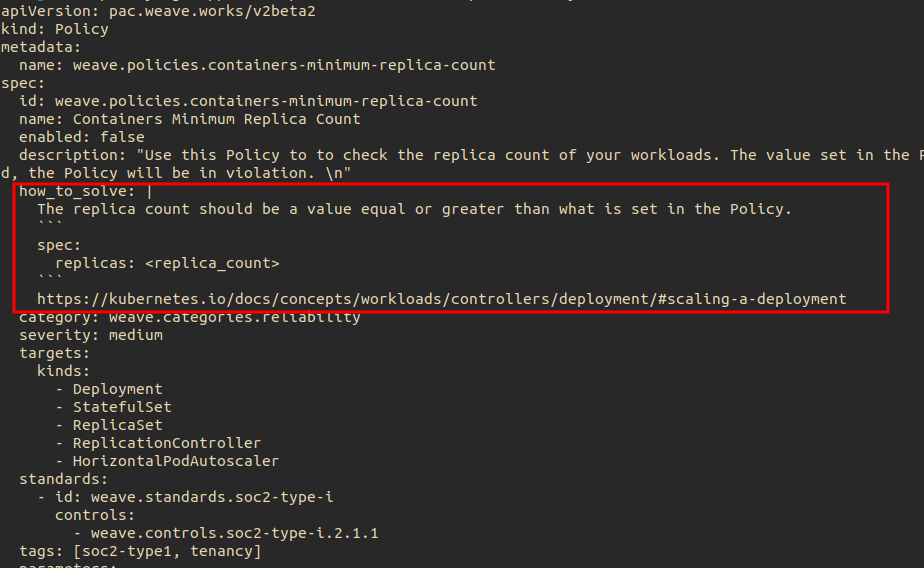
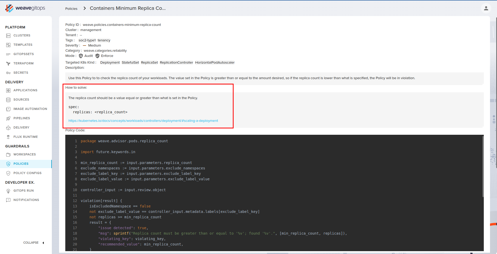

# Getting Started With Weave Policy Agent

## Prerequisites

- Kubernetes Cluster (>= v1.20)
- [Flux](https://fluxcd.io/flux/installation/) (>= v0.36.0)
- [kubectl](https://kubernetes.io/docs/tasks/tools/#kubectl)
- [Cert Manager](https://cert-manager.io/docs/installation/) (>= v1.5.0)
- [WeaveGitOps UI]()(Optional)

If you are not using flux, you need to have both [Helm](https://helm.sh/docs/intro/install/) and [Kustomize](https://kubectl.docs.kubernetes.io/installation/kustomize/) installed on your cluster

## Installing Weave Policy Agent

By default, the policy agent is configured to enforce policies using kubernetes admisson controller, and publish the violation events to Kubernetes Events. For advanced configurations, please check [here](../helm/values.yaml).

To install Weave Policy Agent, you can use Flux and HelmRelease as part of GitOps ecosystem, or you can directly install the agent using just Helm. 

### Using HelmRelease and Flux

Create `policy-system` namespace to install the chart in

  ```bash
  kubectl create ns policy-system
  ```

In your flux repo root, create the following `HelmRepository` and `HelmRelease` manifests that reference the policy helm chart. 

Note: You can create these manifests in another directory, just make sure the directory is getting reconciled by flux.

<details>
  <summary>wpa-helmrepo.yaml - Click to expand .. </summary>

```yaml
apiVersion: source.toolkit.fluxcd.io/v1beta2
kind: HelmRepository
metadata:
  creationTimestamp: null
  name: policy-agent
  namespace: flux-system
spec:
  interval: 1m0s
  timeout: 1m0s
  url: https://weaveworks.github.io/policy-agent/
status: {}
```
</details>

<details>
  <summary>wpa-helmrelease.yaml - Click to expand .. </summary>

```yaml
apiVersion: helm.toolkit.fluxcd.io/v2beta1
kind: HelmRelease
metadata:
  name: policy-agent
  namespace: flux-system
spec:
  chart:
    spec:
      chart: policy-agent
      sourceRef:
        apiVersion: source.toolkit.fluxcd.io/v1beta2
        kind: HelmRepository
        name: policy-agent
        namespace: flux-system
      version: 2.3.0
  interval: 10m0s
  targetNamespace: policy-system
  values:
    caCertificate: ""
    certificate: ""
    config:
      accountId: ""
      admission:
        enabled: true
        sinks:
          k8sEventsSink:
            enabled: true
      audit:
        enabled: false
      clusterId: ""
    excludeNamespaces:
    - kube-system
    failurePolicy: Fail
    image: weaveworks/policy-agent
    key: ""
    persistence:
      enabled: false
    useCertManager: true
status: {}
```
</details>

Once the `HelmRepository` and `HelmRelease` are reconciled by `Flux`, you should find the Policy Agent installed on your cluster.

The repository tree should be something like the following:

  <details>
    <summary>Repository tree - Click to expand .. </summary>

  ```bash
  .
  └── clusters
      └── my-cluster
          ├── flux-system
          │   ├── gotk-components.yaml
          │   ├── gotk-sync.yaml
          │   └── kustomization.yaml
          ├── wpa-helmrelease.yaml
          └── wpa-helmrepo.yaml
  ```

  </details>

Check installation status using the below commands, you should expect to see the success of HelmRelease installation and the pod of the agent running.

```bash
flux get helmrelease -A
kubectl get pods -n policy-system
```

### Using Helm

Create `policy-system` namespace to install the chart in.

  ```bash
  kubectl create ns policy-system
  ```

Add the Weave Policy Agent helm chart.

  ```bash
  helm repo add policy-agent https://weaveworks.github.io/policy-agent/
  ```

Install the helm chart.

  ```bash
  helm install policy-agent policy-agent/policy-agent -n policy-system
  ```

Check the installation status using the below command, you should expect the pod of the agent to be running.

  ```bash
  kubectl get pods -n policy-system
  ```

## Installing Policies

Weave Policy Agent uses policies custom resources to validate resources compliance. Policy custom resource follows this definition ([Policy CRD](../helm/crds/pac.weave.works_policies.yaml)), and it consists of policy code and policy meta data. Policy code is written in OPA Rego Language. 

To get started, you can use the default policies found [here](../policies/), which covers some kubernetes and flux best practices. 

### Using Flux Kustomization

In flux repo, beside the policy agent helm repo and helm release files, create the following mainfest file to reference the default policies from the policy agent repository and push it to your cluster.

<details>
  <summary>policies.yaml - Click to expand .. </summary>

```yaml
apiVersion: source.toolkit.fluxcd.io/v1
kind: GitRepository
metadata:
  name: policies
  namespace: flux-system
spec:
  interval: 5m
  url: https://github.com/weaveworks/policy-agent/
  ref:
    branch: master
---
apiVersion: kustomize.toolkit.fluxcd.io/v1
kind: Kustomization
metadata:
  name: policies
  namespace: flux-system
spec:
  interval: 10m
  targetNamespace: default
  sourceRef:
    kind: GitRepository
    name: policies
  path: "./policies"
  prune: true
  timeout: 1m
```
</details>

### Using Kustomize

Create `policies` directory and create the following `kustomization.yaml` file, then from the parent directory apply it to your Kubernetes cluster using the command below.

``` bash
  kubectl apply -k policies
``` 

<details>
  <summary>kustomization.yaml - Click to expand .. </summary>

```yaml
apiVersion: kustomize.config.k8s.io/v1beta1
kind: Kustomization
resources:
- github.com/weaveworks/policy-agent/policies
```

</details>

### Verify Policies Installation

You can verify the installation by running the following command. If the installation is successful, the output will show a list of all the default policies.

```bash
kubectl get policies
```

### View Policies in WeaveGitOps

If you have WeaveGitOps UI installed on your cluster, you can use it to explore the policies installed on the cluster, as well as, explore the details on each policy. 

<!--  -->

## Explore Violations

With the agent and policies installed, Weave Policy Agent will prevent any resource that violate the relevant polices from being created or updated. 

When using flux, flux reconcilation will fail if one of your application resources is violating any of the policies. 

You should be able to see an error like this: 

  <details>
    <summary>Admission controller  violation error - Click to expand .. </summary>

    ```bash
    Error from server (==================================================================
    ==================================================================
    Policy	: weave.policies.containers-minimum-replica-count
    Entity	: deployment/nginx-deployment in namespace: default
    Occurrences:
    - Replica count must be greater than or equal to '2'; found '1'.
    ): error when creating "deployment.yaml": admission webhook "admission.agent.weaveworks" denied the request: 
    ==================================================================
    Policy	: weave.policies.containers-minimum-replica-count
    Entity	: deployment/nginx-deployment in namespace: default
    Occurrences:
    - Replica count must be greater than or equal to '2'; found '1'.
    ```

  </details>

### Violating Deployment Example
If you don't have a violating application/resource on your cluster, you can use the following Deployment as an example to try the agent out. 

This deployment is violating `Containers Minimum Replica Count` policy by having 1 replicas instead of min. 2 replicas.

If you are using flux, try adding the deployment to your flux repo root directory. Or you can simply apply it directly to your cluster using `kubectl apply`.

  <details>
  <summary>violating-deployment.yaml - Click to expand .. </summary>

  ```yaml
  apiVersion: apps/v1
  kind: Deployment
  metadata:
  name: nginx-deployment
  namespace: default
  labels:
      app: nginx
  spec:
  replicas: 1
  selector:
      matchLabels:
      app: nginx
  template:
      metadata:
      labels:
          app: nginx
      spec:
      containers:
      - name: nginx
          image: nginx:1.14.2
          ports:
          - containerPort: 80
  ```

  </details>

### Check violations via Kubernetes Events

Since Kubernetes events are configured as a sink for the admission mode, you can use the following command to list policy violatons.

  ```bash
  kubectl get events --field-selector type=Warning,reason=PolicyViolation -A
  ```

### Check violations via WeaveGitOps UI

If you have WeaveGitOps UI installed, you can find each policy violations listed in Violations tab inside each policy. 

  <!--  -->

## Fix Policy Violations

Your next step is to start fix policy violations, for that you can follow the remediation steps listed in each policy, apply them to the violating resources, and re-apply the resource or let flux sync the updated manifest.

Remediation steps are aavailable in the policy custom resource `yaml`, under the `how_to_resolve` section. 

  

The remediation steps also are viewable using WeaveGitOps UI in each policy page.   

  <!--  -->

### Fix Deployment Example Violation

To fix the violation on the deployment example, simply update the `replicas` count from `1` to `2`, then apply or sync the deployment. It should pass the violation and the new manifest gets applied.

## Exclude Namespaces

Usually, you will have certain namespaces that you need to be excluded from policy evaluation, because they are vital to how your cluster operate and you don't want them affected by policy violations, for example `kube-system` and `flux-system`. 

To prevent the agent from scanning certain namespaces and stop deployments, you can add these namespaces to `excludeNamespaces` in the Policy Agent helm chart values file.

To prevent a certain policy from running in a specific namespace, you can add these namespaces to the policy's `exclude_namespaces` parameter, either by a direct modification to the policy file or by using `kustomize` overlays.
